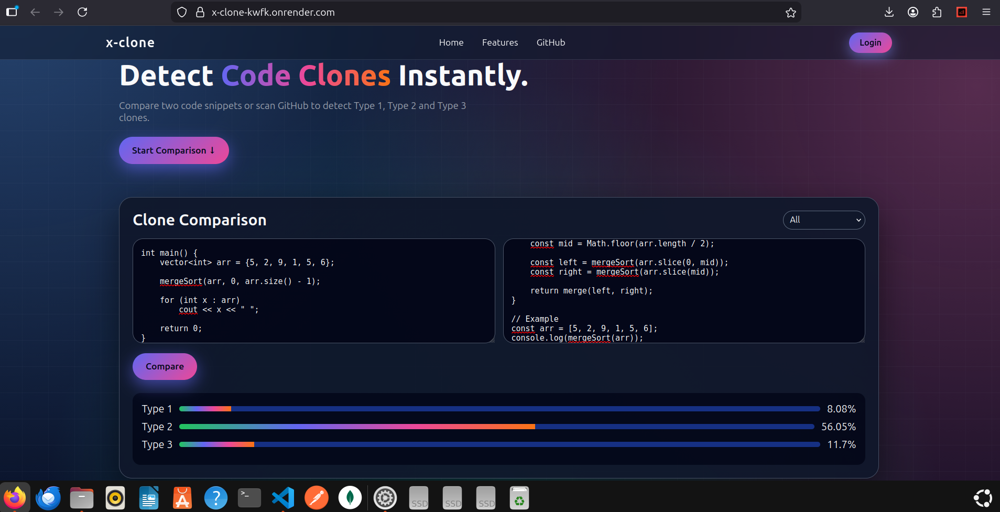

# 🔍 Code Clone Detector

A powerful code similarity detection tool that identifies duplicated or near-duplicated code using **Type-1, Type-2, and Type-3 clone detection techniques**.

This project helps detect plagiarism, redundant logic, and structural similarities across source files.

---

## 🚀 Features

- ✅ Detects **Type-1 (Exact) Clones**
- ✅ Detects **Type-2 (Renamed) Clones**
- ✅ Detects **Type-3 (Near-Miss) Clones**
- ✅ Works across multiple files
- ✅ Token-based normalization
- ✅ Similarity scoring using structural comparison

---

## 🖼️ Demo

### 📌 Clone Detection Output

<!-- IMAGE 1: Add screenshot of detection result here -->

---

## 🧠 How It Works

The system detects three main types of code clones:

---

### 🔹 Type-1 Clone Detection (Exact Match)

**Definition:**  
Two code fragments are identical except for whitespace and comments.

**Approach:**
1. Remove comments
2. Remove extra whitespace
3. Normalize formatting
4. Perform direct string comparison or hashing
